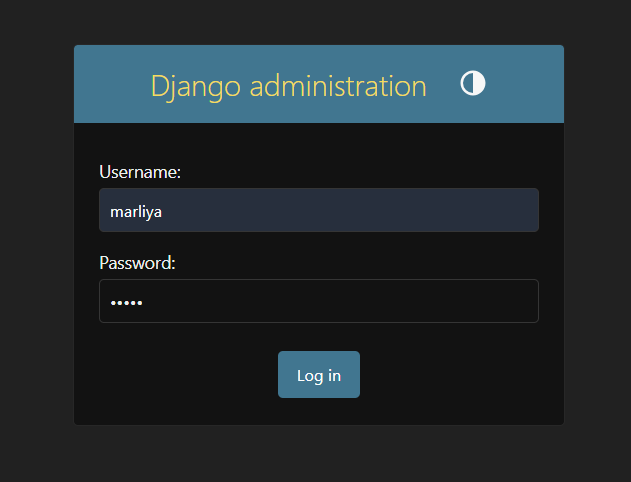
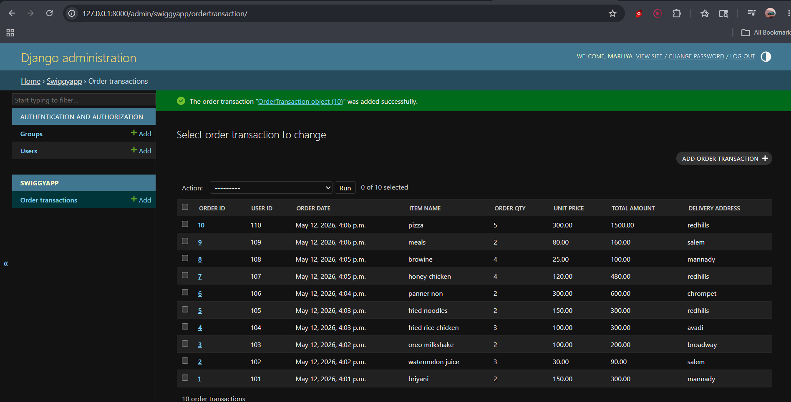

# Ex01 Django ORM Web Application
## Date: 30/4/26

## AIM
To develop a Django application to manage an online food delivery platform like Zomato/Swiggy using Object Relational Mapping (ORM).


## DESIGN STEPS

### STEP 1:
Clone the problem from GitHub

### STEP 2:
Create a new app in Django project

### STEP 3:git remote set-url origin
Enter the code for admin.py and models.py

### STEP 4:
Execute Django admin and create details for 10 books

## PROGRAM
models.py
```
from django.db import models
from django.contrib import admin
class OrderTransaction(models.Model):
    Order_id = models.IntegerField(primary_key=True)
    User_id = models.IntegerField()
    Order_date = models.DateTimeField(auto_now_add=True)
    Item_name = models.CharField(max_length=200)
    Order_qty = models.IntegerField()
    Unit_price = models.DecimalField(max_digits=10, decimal_places=2)
    Total_amount = models.DecimalField(max_digits=10, decimal_places=2)
    Delivery_address = models.CharField(max_length=300)
    
class OrderTransactionAdmin(admin.ModelAdmin):
    list_display=('Order_id','User_id','Order_date','Item_name','Order_qty','Unit_price','Total_amount','Delivery_address')
    ```
    admin.py
    ```
from django.contrib import admin
from .models import OrderTransaction,OrderTransactionAdmin
admin.site.register(OrderTransaction,OrderTransactionAdmin)
```
## OUTPUT




## RESULT
Thus the program for creating a database using ORM hass been executed successfully
